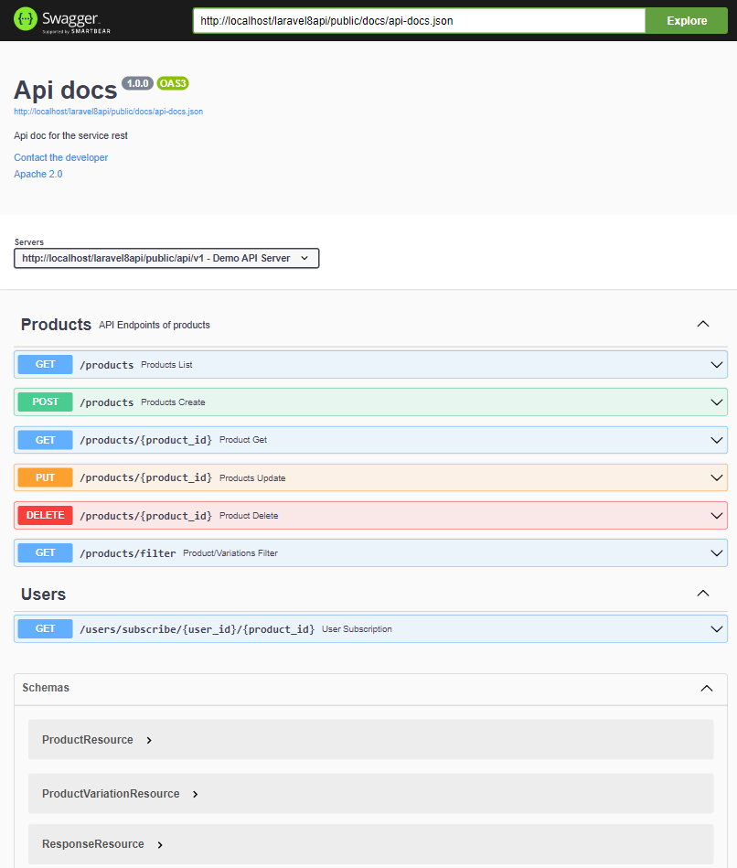

# Api rest Demo con Laravel 8 

Esta Api Rest fué desarrollada con fines demostrativos y prácticos con el framework Laravel en su versión 8.2, donde se plantean los siguientes requisitos:


+ Realizar CRUD (crear, actualizar, eliminar) de los siguientes datos de productos. 

    + Nombre
    + Descripción
    + Atributos (Color, talla, etc... pueden estar predefinidos)
    + Precio
    + stock

+ El precio del producto puede variar en dependencia de los atributos del producto
+ Filtrar por nombre, descripción, atributos, precio (desde-hasta), indicar si  se desean filtrar solo productos con stock en existencia
+ Suscribir usuarios a productos sin stock y avisarle (con un email) de manera automática cuando se reponga stock, solo se debe avisar a la cantidad de clientes para los que alcance el stock.



## Desarrollo

### Análisis y gestión de base de datos:
+ Se necesita tabla products (name, description, price, stock) para almacenar datos del producto
+ Se necesita tabla attributes(name description) para almacenar los nombre de los atributos como son color, talla, estado 
+ Se necesita tabla attributes_options(name, attribute_id) para almacenar los nombres de las opciones de cada atributos, por ejemplo: para el atributo color, opciones como: rojo, negro, blanco, para el atributo tamaño, opciones como grande, mediano, pequeño.
+ Se necesita tabla product_attribute_values(attribute_option_id, product_id, price) para relacionar los productos con las opciones de los atributos que posea y donde se almacena también el precio, creando así variaciones del mismo producto, pudiera tenerse aca un stock para cada variación.
+ Se necesita tabla userSubscription(user_id, product_id) donde se relacionen los usuarios con los productos a los que se desea suscribir.

### Codificación

+ Se crean clases migrations y clases models eloquent con soporte a factory para la creación de objetos en masa que facilitan el proceso de realizar test.
+ Se realizan relationships entre los models.
+ Se especializa la función create del model [Product](https://github.com/yurisnel/laravel8api/blob/main/app/Model/Product.php) donde se implementa funcionalidad para  facilitar la [creación](#creación_de_producto/variaciones) de las variaciones de productos.
+ Se utiliza patrón [repository](https://github.com/yurisnel/laravel8api/blob/main/app/Repositories/ProductRepository.php) donde se realizan todas las operaciones con los modelos y base de datos.
+ Se utiliza patrón observable creando [event](https://github.com/yurisnel/laravel8api/blob/main/app/Events/ProductUpdateEvent.php) para cuando se actualiza el stock de productos un [listeners](https://github.com/yurisnel/laravel8api/blob/main/app/Listeners/ProductUpdateListener.php) realice la operación de notificar por correo a clientes que están suscriptos al producto.
+ Se manejan los errores, se crea clase personalizada de Error, se capturan todos las excepciones en un único lugar previsto por laravel > Exceptions\Handler.php. Se agrega opción para imprimir en log los sql cuando la variable *DB_SQL_DEBUG_LOG* sea true.
+ Se utilizan clases Resources para dar formato a las respuestas http.
+ Se implementa documentación del API con OpenAPI y Swagger con el módulo darkaonline/l5+swagger. Para lo que se utilizan anotaciones en los controller y en las clases Resources donde se crean Schema reutilizable que facilitan la generación del api doc.
+ Se implementan [Test](https://github.com/yurisnel/laravel8api/blob/main/tests/Feature/ProductTest.php) automáticos.


### Creación de producto/variaciones
Realizar una petición post a *{dominio}/api/v1/products* con el siguiente json en el body: 
```
{
  "id": 1,
  "name": "product 01",
  "description": "description test",
  "stock": 100,
  "price": 50.99,
  "variations": [
    {
      "attribute": "color",
      "option": "blue",
      "price": 50.99
    }
  ]
}
```
Se puede especificar en *variations* tantas como se desea, en caso de que no exista el atributo/option se agregará en las tablas *attributes*, *attributes_option* correspondiente y se creará la asociación con el producto en la tabla *product_attribute_value* con el precio indicado para cada variación del producto.

### Filtrado de producto/variaciones
Realizar una petición Get a *{dominio}/api/v1/products/filter* con uno o más parámetros por url con el siguiente formato:
```
name=Producto name set&description=description set&price=50-99&variations=small,blue
```
- Para los campos *name* y *description* se utilizan filtros de %text%
- El *price* puede indicarse único o en rango
- Los *atrributes* se indican separados por ,
- En la preciencia de más de un filtro se realizan *AND*

## Entorno de desarrollo utilizado
+ php 7.4.22 (requerido 7.3+)
+ mysql 5.1
+ composer 2.1.14
+ Visual Code 1.63.1

## Implementación de la solución

1. Clonar repositorio: https://github.com/yurisnel/laravel8api
2. Descargar dependencias: *composer install*
3. Crear base de datos 
4. Duplicar *.env.example* y cambiar nombre a *.env*
5. Indicar en el fichero *.env* los datos de acceso al servidor(DB_CONNECTION, DB_HOST, DB_PORT, DB_DATABASE, DB_USERNAME, DB_PASSWORD) 
6. Ejecutar migraciones para crear base de datos: *php artisan migrate* (agregar al comando *--seed* para insertar datos de pruebas)
7. Documentación del api: 
http://localhost/laravel8api/public/api/documentation
8. Para realizar test: 
    - Duplicar *.env.example* y cambiar nombre a *.env.testing*
    - Indicar en el fichero *.env.testing* los datos de acceso al servidor (la base de datos no debe ser la misma, crear una nueva)
    - Ejecutar: *php artisan test*


## License

The Laravel framework is open+sourced software licensed under the [MIT license](https://opensource.org/licenses/MIT).
